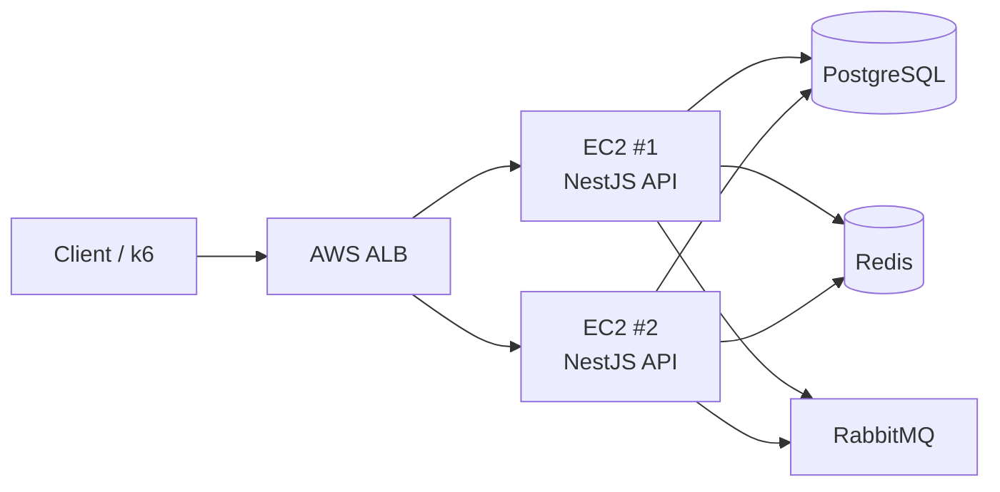

# Flash Sale Lab

Flash Sale 환경을 가정해 **동시성, 비동기 메시징, 장애 복구, Scale-out, Observability, CI/CD**를 직접 재현하고 검증한 백엔드 프로젝트입니다.

기술을 먼저 추가하기보다 **문제 재현 → 원인 분석 → 필요한 기술 도입 → Before/After 검증** 순서로 시스템을 발전시켰습니다.

---

## Architecture



두 NestJS API 인스턴스를 ALB 뒤에 배치하고 Stateless하게 운영했습니다.

PostgreSQL, Redis, RabbitMQ는 Primary EC2의 Shared State로 사용해 Multi-API 환경에서 주문 정합성, Consumer 멱등성, 메시지 분산 처리를 검증했습니다.

---

## Key Results

| 항목            | 결과                                                                |
| --------------- | ------------------------------------------------------------------- |
| 주문 정합성     | 재고 100 / 동시 주문 150 → **100 성공 / 50 실패 / 재고 0**          |
| GET 성능 개선   | RPS **1,222.90 → 2,186.68**, p95 **135.18ms → 74.88ms**             |
| AWS Scale-out   | 1 API → 2 API에서 RPS **2,235.46 → 3,734.40 (+67.1%)**              |
| Consumer 멱등성 | 동일 orderId 10건 동시 발행 → **실제 알림 1회**                     |
| Consumer Crash  | 처리 중 crash에서 메시지 유실 발견 → **processing-retry 기반 복구** |
| Retry Hardening | 35초 간격 무한 순환 재현 → **최대 3회 후 DLQ 격리**                 |

---

## Key Engineering Challenges

### 동시 주문 정합성

동시에 여러 주문이 같은 재고를 차감할 때 발생할 수 있는 초과 판매 문제를 재현하고 Transaction과 조건부 재고 차감을 적용했습니다.

AWS Multi-EC2 환경에서도 재고 100개에 150건을 동시에 요청해 **100건 성공 / 50건 충돌 / 최종 재고 0**을 확인했습니다.

### RabbitMQ / Outbox / Consumer 멱등성

주문 후처리를 RabbitMQ 기반으로 비동기화하고 Outbox Pattern을 적용했습니다.

Redis 기반 처리 상태를 이용해 Consumer 멱등성을 보장하고, Consumer crash 과정에서 발견한 메시지 유실 문제를 `processing-retry` Queue를 통해 복구했습니다.

### AWS Scale-out & Bottleneck Analysis

AWS에서 API를 1대에서 2대로 확장하고 ALB로 요청을 분산했습니다.

100 VUs 기준 RPS는 **2,235.46 → 3,734.40(+67.1%)**로 증가했습니다.

200 VUs에서는 처리량 증가폭이 둔화됐고 PostgreSQL/Redis보다 API CPU가 높게 사용되어, Scale-out 이후 새로운 병목이 API 계층으로 이동했음을 확인했습니다.

### Production Hardening

SIGTERM 시 진행 중인 Consumer 메시지와 HTTP 요청이 중단되는 문제를 재현하고 Graceful Shutdown을 적용했습니다.

또한 영구 processing lock 상황에서 메시지가 약 35초마다 무한 순환하는 것을 확인해 **최대 3회 재시도 후 DLQ로 격리**하도록 개선했습니다.

---

## Tech Stack

**Backend**
NestJS · TypeScript · Prisma · PostgreSQL

**Cache / Messaging**
Redis · RabbitMQ

**Infrastructure**
Docker · Nginx · AWS EC2 · ALB · ECR · IAM/OIDC · SSM · Parameter Store

**Observability**
Prometheus · Grafana · OpenTelemetry · Tempo · Loki

**Testing / Automation**
Jest · k6 · GitHub Actions

---

## CI/CD

```text
Pull Request
→ lint / test / typecheck / build
→ main merge
→ GitHub Actions
→ OIDC로 AWS 인증
→ Docker image build
→ ECR push
→ SSM을 통한 EC2 배포
```

---

## Running Locally

```bash
pnpm install
pnpm exec prisma generate

docker compose up -d

pnpm start:dev
```

검증:

```bash
pnpm lint
pnpm test
pnpm exec tsc --noEmit
pnpm build
```
